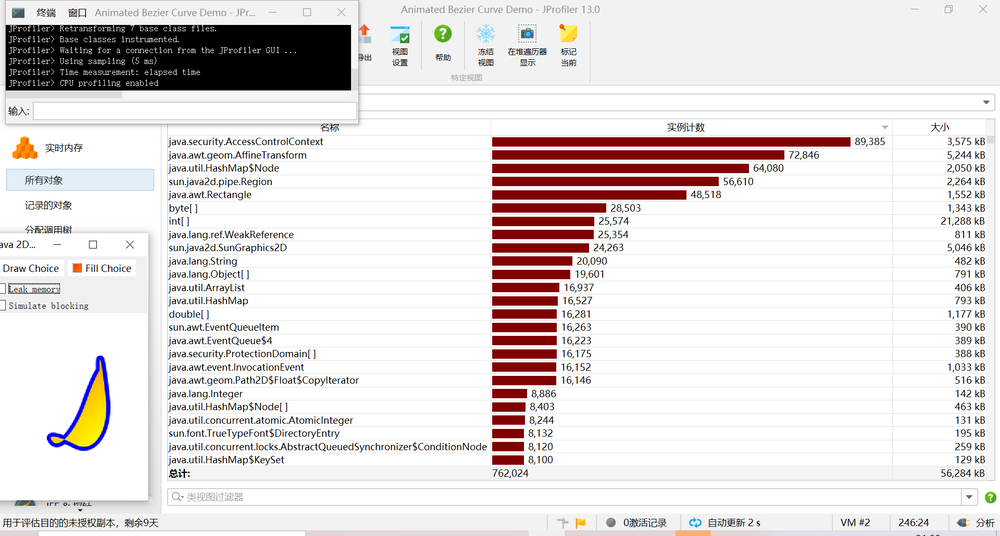

# *java性能测试——插入排序*
## 1.过程
   - 在idealc中下载Jprofile插件
   - 下载Jprofile,Setting——tools——jprofile设置包位置
   - Jprofile中进行会话设置
## 2.结论
   - 性能测试结果如图所示：
   -  
   - 根据其封装的上下文做出系统资源访问决策即AccessControlContext
  的操作耗时最长。